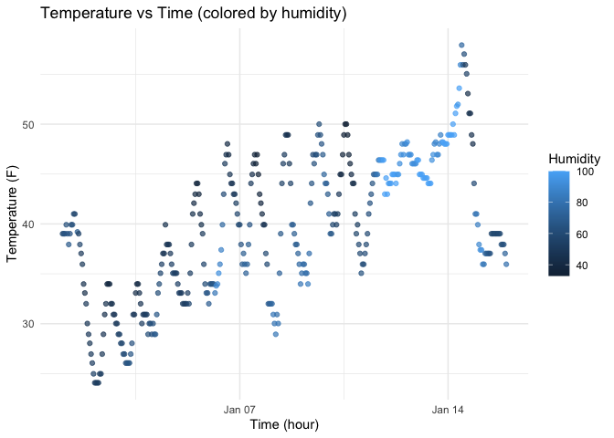

Homework_1_jg5037
================
Jian Gao
2025-09-14

# Problem 1

## Part a

``` r
library(moderndive)
library(ggplot2)
data("early_january_weather")
```

The variables included in the dataset are: origin, year, month, day,
hour, temp, dewp, humid, wind_dir, wind_speed, wind_gust, precip,
pressure, visib, time_hour.

Key variables include:  
- **Temperature (`temp`)**: numeric, with an average of about 39.6 °F  
- **Humidity (`humid`)**: numeric, ranging from 32.9 to 100  
- **Time (`time_hour`)**: POSIXct variable recording the observation
time, ranging from 2013-01-01 01:00:00 to 2013-01-15 23:00:00  
- Other variables include wind speed (`wind_speed`), precipitation
(`precip`), and visibility (`visib`).

``` r
library(ggplot2)

p <- ggplot(early_january_weather, aes(x = time_hour, y = temp, color = humid)) +
  geom_point(alpha = 0.7) +
  labs(
    title = "Temperature vs Time (colored by humidity)",
    x = "Time (hour)",
    y = "Temperature (F)",
    color = "Humidity"
  ) +
  theme_minimal()

# show the ggplot
p
```

<!-- -->

``` r
# Save to project directory
ggsave("scatter_temp_time.png", p, width = 7, height = 5)
```
